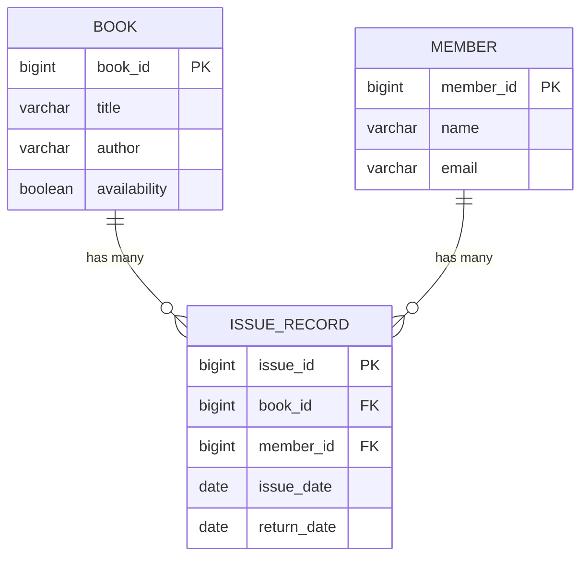
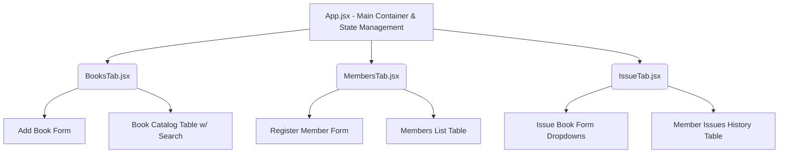

# Library Management System - Design Document

This document outlines the high-level architecture, database schema, API specifications, and frontend component structure for the Library Book Management System.

---

## 1. System Architecture
The application uses a standard 3-tier architecture:
- **Presentation Layer (Frontend)**: React 18 single-page application built with Vite.
- **Application Layer (Backend)**: Spring Boot 3.2 providing a stateless REST API.
- **Data Layer (Database)**: PostgreSQL managed via Spring Data JPA (Hibernate).

---

## 2. Database Design (Entity-Relationship)

The system revolves around three core entities: `Book`, `Member`, and `IssueRecord`.

### Table Details
1. **Book Table**: Stores catalog information. `availability` is a boolean flag (true = available, false = currently issued).
2. **Member Table**: Stores registered users. `email` is enforced as a unique identifier conceptually.
3. **IssueRecord Table**: The transaction/join table. Maps which member borrowed which book and when. If `return_date` is null, the book is currently held by the member.

---

## 3. REST API Design

The backend endpoints follow RESTful conventions returning JSON payloads. 

### Books API (`/books`)
| HTTP Method | Endpoint | Purpose | Request Body |
|-------------|----------|---------|--------------|
| **GET** | `/books` | List all books | None |
| **GET** | `/books/available` | List books where `availability=true` | None |
| **GET** | `/books/search?query={q}` | Search books by title/author | None |
| **POST** | `/books` | Add a new book to the catalog | `{ "title": "...", "author": "..." }` |

### Members API (`/members`)
| HTTP Method | Endpoint | Purpose | Request Body |
|-------------|----------|---------|--------------|
| **GET** | `/members` | List all members | None |
| **GET** | `/members/{id}` | Get specific member details | None |
| **POST** | `/members` | Register a new member | `{ "name": "...", "email": "..." }` |
| **GET** | `/members/{id}/issues` | Get a member's issue history | None |

### Issues API (`/issues`)
| HTTP Method | Endpoint | Purpose | Request Body |
|-------------|----------|---------|--------------|
| **POST** | `/issues/issue` | Issue a book to a member | `{ "bookId": 1, "memberId": 1 }` |
| **PUT** | `/issues/return/{id}` | Return a specific issue record | None |

---

## 4. Frontend Design (React Component Tree)

The frontend is a Single Page Application (SPA) utilizing conditional rendering for tab navigation instead of a complex router, keeping the UI fast and simple.

### Component Breakdown
- **`App.jsx`**: Manages the global layout (Header, Notification banners) and maintains the `activeTab` state to conditionally render the sub-components.
- **`BooksTab.jsx`**: 
  - Maintains `books` state array.
  - Form handles `POST /books`.
  - Table maps over the books array to display ID, Title, Author, and a dynamic Status badge.
- **`MembersTab.jsx`**: 
  - Maintains `members` state array.
  - Form handles `POST /members`.
- **`IssueTab.jsx`**: 
  - Loads data from `/books/available` and `/members` to populate select dropdowns on mount.
  - Table dynamically displays an action button (`Return Book`) or static text (`Returned`) depending on the `returnDate` property of the issue record.
